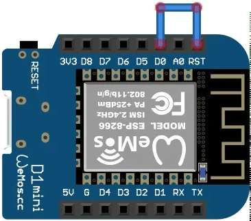

# Wemos-D1-Mini-SHT30-DeepSleep [SundayProjects]

Deep sleep test template for "Wemos D1 Mini" and "SHT30" for saving energy. Code every period publish temperature and humidity via MQTT and directly into InfluxDBv2.

# Setup
Pin ```D0``` and ```RST``` must be connected for proper ```Deep Sleep``` function work.




# Possible Optimization
Found in comments under this video https://www.youtube.com/watch?v=IYuYTfO6iOs

When you use static values for ip, subnet, gateway, dns, ap address you do not need negotiate with your AP, do some scans and you can save some time.

Code example:
```cpp
char ssid[] = "yourSSID";    // your network SSID (name)
char pass[] = "yourPassword"; // your network password (use for WPA, or use as key for WEP)
int32_t channel = 8;
IPAddress ip(192, 168, 0, 254);
IPAddress subnet(255,255,255,0);
IPAddress gateway(192,168,0,1);
IPAddress dns(8,8,8,8);
uint8_t bssid[] = {0x12,0x34,0x56,0x78,0x9A,0xBC};
WiFi.forceSleepWake();
  WiFi.mode(WIFI_STA);
  yield();
  WiFi.config(ip,dns,gateway,subnet);
  WiFi.begin(ssid, pass, channel, bssid, true);
  while (WiFi.status() != WL_CONNECTED) {
        delay(500);
        Serial.print(".");
  }
  Serial.println("Connected to WiFi");

```

Another improvement is to use ```WiFi.persistent(true)``` and store data for next run. (https://www.reddit.com/r/esp8266/comments/9w6v5o/how_do_i_minimize_wifi_connection_time_from_power/)

```cpp
#define WIFI_SSID "ssid"
#define WIFI_PASSWORD "password"

// Save boot up time by not configuring them if they haven't changed
if (WiFi.SSID() != WIFI_SSID) {
  Serial.println(F("Initialising Wifi..."));
  WiFi.mode(WIFI_STA);
  WiFi.begin(WIFI_SSID, WIFI_PASSWORD);
  WiFi.persistent(true);
  WiFi.setAutoConnect(true);
  WiFi.setAutoReconnect(true);
}

if (WiFi.waitForConnectResult() != WL_CONNECTED) {
   Serial.println(F("Connection Failed!"));
   timeout_cb();
}

Serial.print(F("IP address: "));
Serial.println(WiFi.localIP());
```

Another option is use this "Very Deep Sleep" option: https://gitlab.com/diy_bloke/verydeepsleep_bme280_sendtodb/blob/5cfaa397f4a345243831fb27357382abf2de3087/%20VeryDeepSleep_BME280_sendToDB.ino

# include/credentials.h
```cpp
const char* ssid = "<ssid>";
const char* password = "<password>";

// MQTT Broker
const char *mqtt_broker = "<mqtt address>";
const char *topic_temperature = "<temperature topic>";
const char *topic_humidity = "<humidity topic>";
const char *mqtt_username = "<mqtt user>";
const char *mqtt_password = "<mqtt password>";
const int mqtt_port = 1883;
```

For InfluxDbv2 part
````cpp
#define INFLUXDB_URL "http://<address>:8086"
#define INFLUXDB_TOKEN "<token>"
#define INFLUXDB_ORG "<organization>"
#define INFLUXDB_BUCKET "<bucket>"

// InfluxDbv2 UI will generate one for (CET-1CEST,M3.5.0,M10.5.0/3)
#define TZ_INFO "<tzinfo>"
```
# Sources
https://www.youtube.com/watch?v=IYuYTfO6iOs

https://www.reddit.com/r/esp8266/comments/9w6v5o/how_do_i_minimize_wifi_connection_time_from_power/

https://gitlab.com/diy_bloke/verydeepsleep_bme280_sendtodb/blob/5cfaa397f4a345243831fb27357382abf2de3087/%20VeryDeepSleep_BME280_sendToDB.ino

